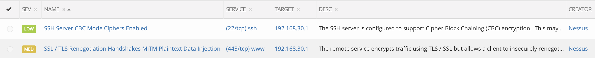
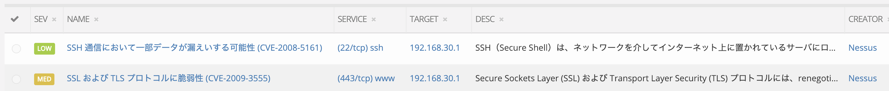

# hanase

## Speak Japanese! / 日本語で話せ！

A simple tool to make [Faraday](https://github.com/infobyte/faraday) **Status Report** (Vulnerabilities name, description, severiry, references, etc) in Japanese

The trick is actually on getting CVE numbers of each vulnerability, in Japan we have a public CVE DB (in Japanese of course) where we can lookup for CVE's, called [JVN iPedia](https://jvndb.jvn.jp/index.html)

## Installation

We assume you already have **Faraday** running and installed on your $HOME/faraday

```
cd ~
git clone https://github.com/ekiojp/hanase
cp hanase/hanase.py hanase/motd-hanase.txt hanase/searcher.patch ~/faraday/scripts/searcher/
cd ~/faraday/scripts/searcher/
chmod 755 hanase.py
patch searcher.py < searcher.patch
```

## Usage

First, get JVN DB (sqlite) using [go-cve-dictionary](https://github.com/kotakanbe/go-cve-dictionary#deploy-go-cve-dictionary)

Grab the full JVN (1998 - 2019) **get a coffee...**

```
cd ~/faraday/scripts/searcher
for i in `seq 1998 $(date +"%Y")`; do $GOPATH/bin/go-cve-dictionary fetchjvn -log-dir . -dbpath /Users/ec/faraday/scripts/searcher/JVN_DB.sqlite -years $i; done
```

Note: check your $PYTHONPATH is pointing to $HOME/faraday
```
export PYTHONPATH=$HOME/faraday
```

Once we have JVN_DB.sqlite (~280Mb) we can use ./hanase.py
```
~/faraday/scripts/searcher$ ./hanase.py
 _
| |__   __ _ _ __   __ _ ___  ___
| '_ \ / _` | '_ \ / _` / __|/ _ \
| | | | (_| | | | | (_| \__ \  __/
|_| |_|\__,_|_| |_|\__,_|___/\___|


Author: Emilio / @ekio_jp
Version: 1.0

usage: hanase.py [-h] [-d] -w <workspace> [-s <server>] -i <input JVN> -o
                 <rules.py> [-u <username>] [-p <password>]

optional arguments:
  -h, --help      show this help message and exit
  -d              Dry-run TEST
  -w <workspace>  Faraday Workspace
  -s <server>     Faraday Server (default: http://localhost:5985)
  -i <input JVN>  JVN DB generated by https://github.com/kotakanbe/go-cve-
                  dictionary (SQLite3)
  -o <rules.py>   Generate rules.py for faraday/scripts/searcher.py
  -u <username>   Faraday Username (default: faraday)
  -p <password>   Faraday Password (default: prompt)
~/faraday/scripts/searcher$
```

Run `hanase.py` for Faraday workspace called `test1`

```
~/faraday/scripts/searcher$ ./hanase.py -w test1 -i JVN_DB.sqlite -o rules.py
Password:
Amount of Vulnerabilities in Workspace:  35
Amount of Templates Added into Faraday:  2
Amount of Rules Generated for search.py (Vuls with 1 CVE only):  2
Vulnerabilities Description Updated (multiple CVE's):  0
Amount of CVE's Found in JVN DB:  2
Amount of CVE's Not Found in JVN DB:  0
~/faraday/scripts/searcher$
```

Run the patched searcher.py, will use the `rules.py` generated by `hanase.py`

The patched searcher.py allow the option of -r to overwrite the existing references with only the ones from JVN if you wish

```
~/faraday/scripts/searcher$ ./searcher.py -h
usage: searcher_v2.py [-h] -w WORKSPACE [-s SERVER] [-u USER] [-p PASSWORD]
                      [-o OUTPUT] [-l LOG] [-r]

Search duplicated objects on Faraday

optional arguments:
  -h, --help            show this help message and exit
  -w WORKSPACE, --workspace WORKSPACE
                        Search duplicated objects into this workspace
  -s SERVER, --server SERVER
                        Faraday server
  -u USER, --user USER  Faraday user
  -p PASSWORD, --password PASSWORD
                        Faraday password
  -o OUTPUT, --output OUTPUT
                        Choose a custom output directory
  -l LOG, --log LOG     Choose a custom log level
  -r, --refs            Overwrite Refs from template
~/faraday/scripts/searcher$
```

```
~/faraday/scripts/searcher$./searcher.py -w test1
Password:
01/04/2019 04:12:36 PM - Faraday searcher - INFO: Started
01/04/2019 04:12:36 PM - Faraday searcher - INFO: Searching objects into workspace one
01/04/2019 04:12:36 PM - Faraday searcher - DEBUG: Getting hosts ...
01/04/2019 04:12:36 PM - Faraday searcher - DEBUG: Getting services ...
01/04/2019 04:12:36 PM - Faraday searcher - DEBUG: Getting vulnerabilities ...
01/04/2019 04:12:36 PM - Faraday searcher - INFO: --> Validating rules ...
01/04/2019 04:12:36 PM - Faraday searcher - INFO: <-- Rules OK
01/04/2019 04:12:36 PM - Faraday searcher - DEBUG: --> Start Process vulnerabilities
01/04/2019 04:12:36 PM - Faraday searcher - DEBUG: Getting models
01/04/2019 04:12:36 PM - Faraday searcher - DEBUG: Getting object
01/04/2019 04:12:36 PM - Faraday searcher - INFO: Running actions of rule 'CVE-2009-3555_84' :
01/04/2019 04:12:36 PM - Faraday searcher - DEBUG: Getting vulnerability templates from http://127.0.0.1:5985/
01/04/2019 04:12:36 PM - Faraday searcher - INFO: Applying template '5' to vulnerability 'SSL および TLS プロトコルに脆弱性 (CVE-2009-3555)' with id '84'
01/04/2019 04:12:36 PM - Faraday searcher - INFO: Done
01/04/2019 04:12:36 PM - Faraday searcher - DEBUG: Inserting rule CVE-2009-3555_84 into SQlite database ...
01/04/2019 04:12:36 PM - Faraday searcher - DEBUG: Done
01/04/2019 04:12:36 PM - Faraday searcher - DEBUG: Getting models
01/04/2019 04:12:36 PM - Faraday searcher - DEBUG: Getting object
01/04/2019 04:12:36 PM - Faraday searcher - INFO: Running actions of rule 'CVE-2008-5161_88' :
01/04/2019 04:12:36 PM - Faraday searcher - DEBUG: Getting vulnerability templates from http://127.0.0.1:5985/
01/04/2019 04:12:36 PM - Faraday searcher - INFO: Applying template '6' to vulnerability 'SSH 通信において一部データが漏えいする可能性 (CVE-2008-5161)' with id '88'
01/04/2019 04:12:36 PM - Faraday searcher - INFO: Done
01/04/2019 04:12:36 PM - Faraday searcher - DEBUG: Inserting rule CVE-2008-5161_88 into SQlite database ...
01/04/2019 04:12:36 PM - Faraday searcher - DEBUG: Done
01/04/2019 04:12:36 PM - Faraday searcher - DEBUG: <-- Finish Process vulnerabilities
01/04/2019 04:12:36 PM - Faraday searcher - DEBUG: --> Start Process services
01/04/2019 04:12:36 PM - Faraday searcher - DEBUG: <-- Finish Process services
01/04/2019 04:12:36 PM - Faraday searcher - DEBUG: --> Start Process Hosts
01/04/2019 04:12:36 PM - Faraday searcher - DEBUG: <-- Finish Process Hosts
01/04/2019 04:12:36 PM - Faraday searcher - DEBUG: <-- Finish Process Hosts
01/04/2019 04:12:36 PM - Faraday searcher - INFO: Finished
~/faraday/scripts/searcher$
```

# Status Report before **hanase.py**



# Status Report after **hanase.py**




# ToDo

- [ ] Make the code nicer

----

# Author

Emilio / [@ekio_jp](https://twitter.com/ekio_jp)

----

# Licence

Please see [LICENSE](https://github.com/ekiojp/hanase/blob/master/LICENSE).
